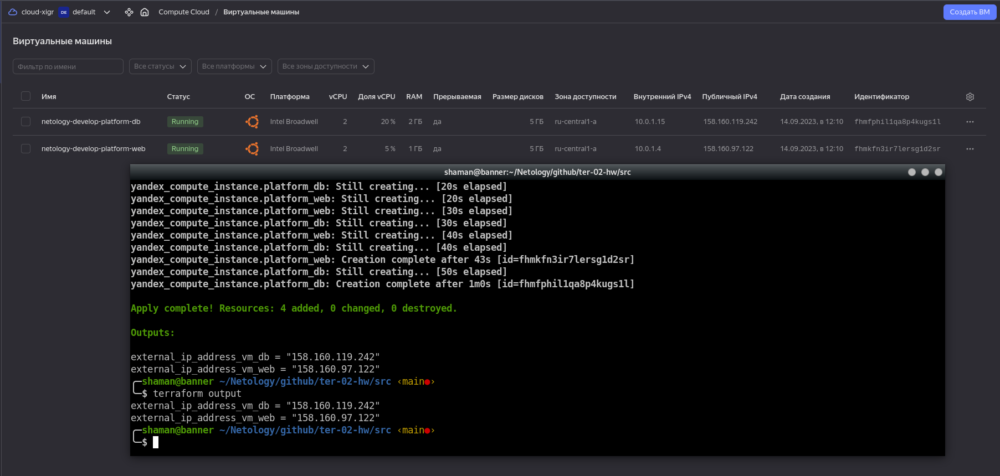

# Домашнее задание к занятию "`Основы Terraform. Yandex Cloud`" - `Живарев Игорь`


### Задание 1
В качестве ответа всегда полностью прикладывайте ваш terraform-код в git.

1. Изучите проект. В файле variables.tf объявлены переменные для Yandex provider.
2. Переименуйте файл personal.auto.tfvars_example в personal.auto.tfvars. Заполните переменные: идентификаторы облака, токен доступа. Благодаря .gitignore этот файл не попадёт в публичный репозиторий. **Вы можете выбрать иной способ безопасно передать секретные данные в terraform.**
3. Сгенерируйте или используйте свой текущий ssh-ключ. Запишите его открытую часть в переменную **vms_ssh_root_key**.
4. Инициализируйте проект, выполните код. Исправьте намеренно допущенные синтаксические ошибки. Ищите внимательно, посимвольно. Ответьте, в чём заключается их суть.
5. Ответьте, как в процессе обучения могут пригодиться параметры ```preemptible = true``` и ```core_fraction=5``` в параметрах ВМ. Ответ в документации Yandex Cloud.

В качестве решения приложите:

- скриншот ЛК Yandex Cloud с созданной ВМ;
- скриншот успешного подключения к консоли ВМ через ssh. К OS ubuntu необходимо подключаться под пользователем ubuntu: "ssh ubuntu@vm_ip_address";
- ответы на вопросы.


## Ответ

При выполнении команды terraform apply появилась ошибка:

```
╷
│ Error: Error while requesting API to create instance: server-request-id = daa89a3a-25ad-47fc-ae45-5e5f3b206cef server-trace-id = 7aec2016c54c2b37:5b44c45641e47058:7aec2016c54c2b37:1 client-request-id = 2b18afc2-129e-4d28-b0fc-a378d969e8ca client-trace-id = d2a22cf3-3379-4e82-af2f-5492e0a5efe9 rpc error: code = FailedPrecondition desc = Platform "standart-v4" not found
│ 
│   with yandex_compute_instance.platform,
│   on main.tf line 15, in resource "yandex_compute_instance" "platform":
│   15: resource "yandex_compute_instance" "platform" {

```
В документация Yandec.Cloud такая платформа не описана. Принято решение использовать платформу `standard-v1`, так же в данной платформе минимальное использование двух ядер CPU. После исправлений блок выглядит следующим образом

```
resource "yandex_compute_instance" "platform" {
  name        = "netology-develop-platform-web"
  platform_id = "standard-v1"
  resources {
    cores         = 2
    memory        = 1
    core_fraction = 5
  }

```


- скриншот ЛК Yandex Cloud с созданной ВМ


- скриншот успешного подключения к консоли ВМ через ssh под пользователем ubuntu: "ssh ubuntu@vm_ip_address"


### Задание 2

1. Изучите файлы проекта.
2. Замените все хардкод-**значения** для ресурсов **yandex_compute_image** и **yandex_compute_instance** на **отдельные** переменные. К названиям переменных ВМ добавьте в начало префикс **vm_web_** .  Пример: **vm_web_name**.
2. Объявите нужные переменные в файле variables.tf, обязательно указывайте тип переменной. Заполните их **default** прежними значениями из main.tf. 
3. Проверьте terraform plan. Изменений быть не должно. 


## Ответ

Согласно заданию часть кода выглядит теперь таким образом

```
data "yandex_compute_image" "ubuntu" {
  family = var.vm_web_compute_image
}
resource "yandex_compute_instance" "platform" {
  name        = var.vm_web_compute_instance
  platform_id = var.vm_web_platform_id
  resources {
    cores         = 2
    memory        = 1
    core_fraction = 5
  }
```

Команда `terraform plan` изменений не обнаружила


### Задание 3

1. Создайте в корне проекта файл 'vms_platform.tf' . Перенесите в него все переменные первой ВМ.
2. Скопируйте блок ресурса и создайте с его помощью вторую ВМ в файле main.tf: **"netology-develop-platform-db"** ,  cores  = 2, memory = 2, core_fraction = 20. Объявите её переменные с префиксом **vm_db_** в том же файле ('vms_platform.tf').
3. Примените изменения.


## Ответ

Состав файла `vms_platform.tf`

```
variable "vm_web_compute_image" {
  type        = string
  default     = "ubuntu-2004-lts"
  description = "Manage images"
}

variable "vm_web_compute_instance" {
  type        = string
  default     = "netology-develop-platform-web"
  description = "Manage virtual machine instances"
}

variable "vm_web_platform_id" {
  type        = string
  default     = "standard-v1"
  description = "Types of physical processors"
}

variable "vm_db_compute_instance" {
  type        = string
  default     = "netology-develop-platform-db"
  description = "Manage virtual machine instances"
}

variable "vm_db_platform_id" {
  type        = string
  default     = "standard-v1"
  description = "Types of physical processors"
}

###ssh vars

variable "vms_ssh_root_key" {
  type        = string
  default     = "ssh-ed25519 XXXXXXXXXXXXXXXXXXXXXXXXXXXXXXXXXXXXXXXXXXXXXX "
  description = "ssh-keygen -t ed25519"
}

```
Скриншот с двумя виртуалками на Yandex.Cloud


### Задание 4

1. Объявите в файле outputs.tf output типа map, содержащий { instance_name = external_ip } для каждой из ВМ.
2. Примените изменения.

В качестве решения приложите вывод значений ip-адресов команды ```terraform output```.


## Ответ

Состав файла `outputs.tf`

```
output "external_ip_address_vm_web" {
  value = yandex_compute_instance.platform_web.network_interface.0.nat_ip_address
}

output "external_ip_address_vm_db" {
  value = yandex_compute_instance.platform_db.network_interface.0.nat_ip_address
}

```
Web-консоль и терминал с внешними IP-адресами виртуалок




### Задание 5

1. В файле locals.tf опишите в **одном** local-блоке имя каждой ВМ, используйте интерполяцию ${..} с несколькими переменными по примеру из лекции.
2. Замените переменные с именами ВМ из файла variables.tf на созданные вами local-переменные.
3. Примените изменения.


## Ответ

Строки, передающие имена для виртуальных машин в файле `vms_platform.tf` закоментированы.
```
variable "vm_web_compute_image" {
  type        = string
  default     = "ubuntu-2004-lts"
  description = "Manage images"
}

#variable "vm_web_compute_instance" {
#  type        = string
#  default     = "netology-develop-platform-web"
#  description = "Manage virtual machine instances"
#}

variable "vm_web_platform_id" {
  type        = string
  default     = "standard-v1"
  description = "Types of physical processors"
}

#variable "vm_db_compute_instance" {
#  type        = string
#  default     = "netology-develop-platform-db"
#  description = "Manage virtual machine instances"
#}

variable "vm_db_platform_id" {
  type        = string
  default     = "standard-v1"
  description = "Types of physical processors"
}

###ssh vars

variable "vms_ssh_root_key" {
  type        = string
  default     = "ssh-ed25519 AAAAC3NzaC1lZDI1NTE5AAAAIEktd+Bc+kW7z9RvP/794IT/kbmrdtCllpxOdC1H0x8k "
  description = "ssh-keygen -t ed25519"
}

```

Содержимое файла `locals.tf`
```
locals {
  group = "netology"
  env = "develop"
  project = "platform"
}

locals {

  web = "${local.group}-${local.env}-${local.project}-web"
  db = "${local.group}-${local.env}-${local.project}-db"

}

```

Содержимое файла `main.tf` с изменёниями в поле name
```
resource "yandex_vpc_network" "develop" {
  name = var.vpc_name
}
resource "yandex_vpc_subnet" "develop" {
  name           = var.vpc_name
  zone           = var.default_zone
  network_id     = yandex_vpc_network.develop.id
  v4_cidr_blocks = var.default_cidr
}

data "yandex_compute_image" "ubuntu" {
  family = var.vm_web_compute_image
}
resource "yandex_compute_instance" "platform_web" {
  name        = local.web
  platform_id = var.vm_web_platform_id
  resources {
    cores         = 2
    memory        = 1
    core_fraction = 5
  }
  boot_disk {
    initialize_params {
      image_id = data.yandex_compute_image.ubuntu.image_id
    }
  }
  scheduling_policy {
    preemptible = true
  }
  network_interface {
    subnet_id = yandex_vpc_subnet.develop.id
    nat       = true
  }

  metadata = {
    serial-port-enable = 1
    ssh-keys           = "ubuntu:${var.vms_ssh_root_key}"
  }

}

resource "yandex_compute_instance" "platform_db" {
  name        = local.db
  platform_id = var.vm_db_platform_id
  resources {
    cores         = 2
    memory        = 2
    core_fraction = 20
  }
  boot_disk {
    initialize_params {
      image_id = data.yandex_compute_image.ubuntu.image_id
    }
  }
  scheduling_policy {
    preemptible = true
  }
  network_interface {
    subnet_id = yandex_vpc_subnet.develop.id
    nat       = true
  }

  metadata = {
    serial-port-enable = 1
    ssh-keys           = "ubuntu:${var.vms_ssh_root_key}"
  }

}

```

### Задание 6

1. Вместо использования трёх переменных  ".._cores",".._memory",".._core_fraction" в блоке  resources {...}, объедините их в переменные типа **map** с именами "vm_web_resources" и "vm_db_resources". В качестве продвинутой практики попробуйте создать одну map-переменную **vms_resources** и уже внутри неё конфиги обеих ВМ — вложенный map.
2. Также поступите с блоком **metadata {serial-port-enable, ssh-keys}**, эта переменная должна быть общая для всех ваших ВМ.
3. Найдите и удалите все более не используемые переменные проекта.
4. Проверьте terraform plan. Изменений быть не должно.


## Ответ

Переменные типа **map** с именами "vm_web_resources" и "vm_db_resources" были созданы в файле variables.tf. Кусок кода ниже на скриншоте:


Анологично для блока **metadata {serial-port-enable, ssh-keys}**. Единственное отличие, интерполяцию получилось провести только с локальными переменными:


Финальный main.tf:
```
resource "yandex_vpc_network" "develop" {
  name = var.vpc_name
}
resource "yandex_vpc_subnet" "develop" {
  name           = var.vpc_name
  zone           = var.default_zone
  network_id     = yandex_vpc_network.develop.id
  v4_cidr_blocks = var.default_cidr
}

data "yandex_compute_image" "ubuntu" {
  family = var.vm_web_compute_image
}
resource "yandex_compute_instance" "platform_web" {
  name        = local.web
  platform_id = var.vm_web_platform_id
  resources {
    cores         = var.vm_web_resources.cores
    memory        = var.vm_web_resources.memory
    core_fraction = var.vm_web_resources.core_fraction
  }
  boot_disk {
    initialize_params {
      image_id = data.yandex_compute_image.ubuntu.image_id
    }
  }
  scheduling_policy {
    preemptible = true
  }
  network_interface {
    subnet_id = yandex_vpc_subnet.develop.id
    nat       = true
  }

  metadata = {
    serial-port-enable = var.metadata_ssh_enable_ssh-keys.serial-port-enable
    ssh-keys           = var.metadata_ssh_enable_ssh-keys.ssh-keys
  }
}
resource "yandex_compute_instance" "platform_db" {
  name        = local.db
  platform_id = var.vm_db_platform_id
  resources {
    cores         = var.vm_db_resources.cores
    memory        = var.vm_db_resources.memory
    core_fraction = var.vm_db_resources.core_fraction
  }
  boot_disk {
    initialize_params {
      image_id = data.yandex_compute_image.ubuntu.image_id
    }
  }
  scheduling_policy {
    preemptible = true
  }
  network_interface {
    subnet_id = yandex_vpc_subnet.develop.id
    nat       = true
  }

  metadata = {
    serial-port-enable = var.metadata_ssh_enable_ssh-keys.serial-port-enable
    ssh-keys           = var.metadata_ssh_enable_ssh-keys.ssh-keys
  }
}

```
